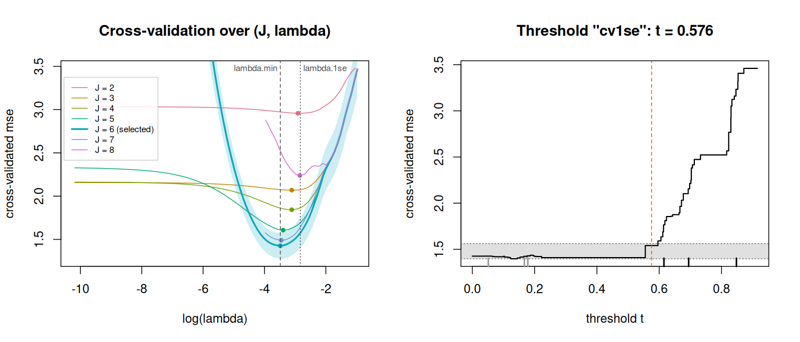
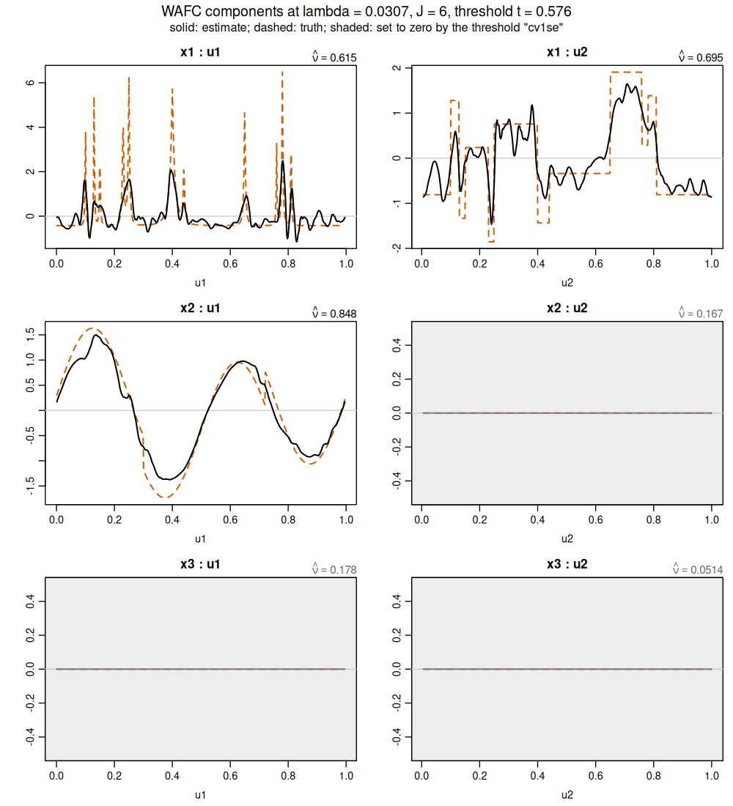
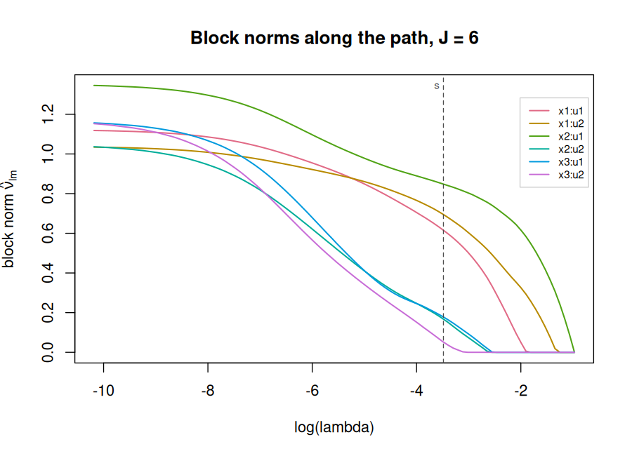

# wafc

O código do método WAFC (decisão D4: pasta dedicada dentro do `wafc-draft`,
não o `WaveBased`; **privado por enquanto**, sem pacote público nem cópia
para outro repositório até E3.3). Organizado como pacote sem ser pacote, para que
empacotar (E3.3) seja mover arquivos:

```
wafc/
├── R/          # funções, um arquivo por tema, cabeçalhos roxygen; load.R carrega tudo
├── tests/      # testthat: Rscript -e 'testthat::test_dir("wafc/tests")'
├── scripts/    # numerados: fumaça, piloto, comparações
└── cache/      # resultados intermediários, não versionado
```

Dependências: `WaveBased` instalado (só `wbasis()`, `wtable()`, para as
bases), `glmnet`, `Matrix`; `grpreg` para o block LASSO, que desde E3.1 é o
padrão de `wafc()` e `cv.wafc()` (D44); `sparsegl` para a variante em
grupos (E2.2); `mgcv`, `splines` e `VCBART` para os competidores (E2.4).
Tudo declarado em `R/load.R`, com o `grpreg` em `wafc_depends` desde D48.
Os gráficos (E3.2) são de base do R (`graphics`, `grDevices`, `utils`), sem
dependência nova.

Carregar tudo numa sessão, da raiz do repositório:

```r
source("wafc/R/load.R")
```

Testes: a suíte padrão (abaixo de um minuto) e a inteira, com os testes
lentos marcados por `skip_slow()` (`tests/helper-slow.R`):

```bash
Rscript -e 'testthat::test_dir("wafc/tests")'
WAFC_SLOW_TESTS=1 Rscript -e 'testthat::test_dir("wafc/tests")'
```

## Interface (E3.1, ratificada em 2026-10-03, D48)

O estimador de D44 e D45 é uma chamada só: o block LASSO balanceado, com
`(J, λ)` por validação cruzada, seguido do limiar `cv1se` nos blocos
`(ℓ, m)`.

```r
cvfit <- cv.wafc(x, u, y)          # o WAFC: bloco + limiar cv1se
predict(cvfit, newx, newu)         # predição do ajuste limiarizado
coef(cvfit)                        # coeficientes limiarizados, em lambda.min
wafc_functions(cvfit)              # c_l e g_lm limiarizados numa grade
wafc_blocks(cvfit)                 # a estrutura selecionada
```

Assinaturas:

```r
wafc(x, u, y, J = 4L, penalty = c("block", "lasso", "sglasso"),
     lambda = NULL, nlambda = 100L, lambda.min.ratio = NULL,
     asparse = 0.05, block.size = NULL, intercept = NULL,
     standardize = FALSE,
     thresh = if (penalty == "block") 1e-4 else 1e-9,
     maxit = NULL, design = NULL, ...)

cv.wafc(x, u, y, J = NULL, penalty = c("block", "lasso", "sglasso"),
        nfolds = 10L, foldid = NULL, lambda = NULL, nlambda = 100L,
        lambda.min.ratio = NULL, type.measure = c("mse", "mae"),
        trace = FALSE, ..., threshold = c("cv1se", "cv", "max", "none"))

## S3 methods for class 'wafc'
coef(object, s = NULL, ...)
predict(object, newx, newu, s = NULL,
        type = c("response", "link", "coefficients", "beta", "nonzero"), ...)
print(x, digits = max(3L, getOption("digits") - 3L), ...)

## S3 methods for class 'cv.wafc'
coef(object, s = c("lambda.min", "lambda.1se"), thresholded = NULL, ...)
predict(object, newx, newu, s = c("lambda.min", "lambda.1se"),
        thresholded = NULL, ...)
print(x, digits = max(3L, getOption("digits") - 3L), ...)

## os gráficos (E3.2, ratificados em 2026-10-03, D49; R/plot.R)
plot(x, which = "components", s = NULL, truth = NULL, grid = NULL,
     n_grid = 512L, ask = NULL, ...)                  # classe 'wafc'
plot(x, which = NULL, s = "lambda.min", thresholded = NULL, truth = NULL,
     grid = NULL, n_grid = 512L, ask = NULL, ...)     # classe 'cv.wafc'
```

O que muda e o que fica:

- **`penalty = "block"`** é `wafc_fit_klopp(penalize.levels = FALSE,
  balanced = TRUE)` num `J`: pedaços de `b_n = block.size` (padrão
  `ceiling(log n)`) a `2b_n − 1` colunas, níveis com `2^j < b_n` num pedaço
  só, níveis `c_ℓ` livres, pesos `sqrt(|G|)` do `grpreg`. A norma do pedaço é
  a do `grpreg`, `‖Z̃_G θ_G‖/√n` com `Z̃` centrado, e o `λ` do objeto é o do
  `grpreg`, sem fator (conferido por `wafc_kkt()`). O bloco sempre tem
  intercepto; `intercept = FALSE` e `standardize = TRUE` são erro. A
  tolerância padrão é a do `grpreg` (`1e-4`), a das medições de E2.5.
- **No `cv.wafc()` com o bloco**, a validação cruzada de cada `J` é o
  `grpreg::cv.grpreg()` nas mesmas dobras, como no `wafc_fit_klopp()`: `cvm`
  é a média sobre as `n` observações e `cvsd` é `sd/sqrt(n)`, onde o LASSO e
  o sparse group LASSO usam a média das médias por dobra e o erro-padrão
  entre dobras. O par `(J, λ)` e o ajuste são os do `wafc_fit_klopp()`.
- **`threshold`** (depois do `...`, para que `thresh` não case parcialmente
  com ele) escolhe o limiar em `lambda.min`, nas dobras da validação
  cruzada, por `wafc_threshold()`, sem reajuste; `"none"` devolve o objeto de
  antes de E3.1. O resultado fica em `cvfit$threshold`; o caminho fica
  intacto em `cvfit$wafc.fit`.
- **`thresholded`** nos métodos de `cv.wafc` (e em `wafc_functions()`,
  `wafc_blocks()`): `NULL` lê o ajuste limiarizado exatamente quando ele
  existe e `s` é `lambda.min`; fora disso lê o caminho, sem limiar; `TRUE`
  onde não há limiar é erro.
- **`wafc_threshold(rule)`** passa a ter `"cv1se"` como padrão.
- Ficam como estavam: `wafc_tune()`, `wafc_sigma()` e `wafc_fit_oracle()`
  com o LASSO por padrão (as regras de informação, da teoria e do QUT são
  regras do LASSO); `wafc_fit_klopp()` e as cinco formas do block LASSO; o
  LASSO e o sparse group LASSO como opção (D43).

## Exemplo (E3.2)

Da raiz do repositório, numa sessão limpa de R. Conferido em 2026-10-03
com `R --vanilla` (R 4.6.1, `grpreg` 3.6.0, `glmnet` 5.1, `WaveBased`
2.6.0), em 16 s; a amostra e as dobras têm semente, então a saída é a
mesma a cada execução.

```r
source("wafc/R/load.R")

## uma amostra do cenário não homogêneo: beta_1 com picos em u1 e degraus
## em u2, beta_2 com o heavisine em u1, beta_3 constante
d <- simulate_wafc(500, p = 3, q = 2, scenario = "inhomogeneous", seed = 2026)

set.seed(1)                         # as dobras da validação cruzada
cvfit <- cv.wafc(d$x, d$u, d$y)     # o WAFC: bloco + limiar cv1se
cvfit

## predição numa amostra nova, contra a função de regressão verdadeira
novo <- simulate_wafc(1000, p = 3, q = 2, scenario = "inhomogeneous", seed = 7)
yhat <- predict(cvfit, novo$x, novo$u)
head(cbind(predito = yhat[, 1], verdade = novo$f), 3)
c(rmse = sqrt(mean((yhat - novo$f)^2)), sd.f = sd(novo$f), sigma = d$sigma)

## a estrutura selecionada: coeficientes não nulos e norma por bloco (l, m)
wafc_blocks(cvfit)

## os gráficos
op <- par(mfrow = c(1, 2))
plot(cvfit)                                   # validação cruzada e limiar
par(op)
plot(cvfit, which = "components", truth = d)  # g_lm limiarizadas e a verdade
plot(cvfit$wafc.fit, which = "path", s = cvfit$lambda.min)  # normas no caminho
```

A saída:

```
Cross-validated WAFC fit

Call: cv.wafc(x = d$x, u = d$u, y = d$y)

Measure: mse ( 10 folds )

 J lambda.min   mse     sd nzero
 2    0.05433 2.958 0.2651    15
 3    0.04450 2.069 0.2280    42
 4    0.04450 1.843 0.2076    67
 5    0.03367 1.607 0.1807   154
 6    0.03067 1.426 0.1504   271
 7    0.03163 1.490 0.1486   397
 8    0.05793 2.239 0.4107   265

Selected: J = 6 with lambda.min = 0.03067 ( lambda.1se = 0.05883 )
Threshold "cv1se" at lambda.min: t = 0.5757, 3 of 6 block(s) kept: x1:u1, x2:u1, x1:u2

       predito    verdade
[1,]  1.006737  0.3031888
[2,]  3.390252  5.4271520
[3,] -1.715764 -1.4971011

     rmse      sd.f     sigma
0.8751646 2.9943485 0.7432451

$nonzero
   u1 u2
x1 63 56
x2 33  0
x3  0  0

$norm
          u1        u2
x1 0.6152751 0.6946161
x2 0.8479703 0.0000000
x3 0.0000000 0.0000000
```

A validação cruzada escolhe `J = 6`, e o limiar `cv1se` mantém
exatamente os três blocos ativos do cenário (`x1:u1`, `x1:u2`, `x2:u1`),
zerando os três nulos, cujas normas antes do limiar eram 0,167, 0,178 e
0,051. O `nzero` da tabela é do caminho; os `$nonzero` acima já são do
ajuste limiarizado.



À esquerda, uma curva por `J`, com a faixa de um erro-padrão do `J`
escolhido; o eixo vertical para no erro do ajuste nulo, e a curva de
`J = 6` sai por cima em `λ` pequeno. À direita, o erro de validação
cruzada do limiar em degraus contra `t`, a faixa de um erro-padrão acima
do mínimo e o `t` do `cv1se`, o maior dentro dela; os traços no eixo são
as normas `ν̂_{ℓm}` dos seis blocos (pretos os mantidos).



As componentes `ĝ_{ℓm}` limiarizadas em `lambda.min` (contínuas) e as
verdadeiras (tracejadas, deslocadas para a média da estimada na grade,
porque o nível é convenção); os blocos zerados pelo limiar vêm sombreados,
com a norma de antes do limiar no canto.



O `plot.wafc()` no caminho de `J = 6`, com `lambda.min` marcado: lido
contra o `t = 0,576` acima, dá os mesmos três blocos.

As figuras saem do mesmo código com `png()` em volta de cada `plot`:

```r
png("wafc/man-figures/cv-threshold.png", width = 1400, height = 600, res = 130)
op <- par(mfrow = c(1, 2)); plot(cvfit); par(op)
dev.off()
png("wafc/man-figures/components.png", width = 1000, height = 1100, res = 130)
plot(cvfit, which = "components", truth = d)
dev.off()
png("wafc/man-figures/path.png", width = 900, height = 650, res = 130)
plot(cvfit$wafc.fit, which = "path", s = cvfit$lambda.min)
dev.off()
```

| Arquivo | Etapa | O que tem |
|---|---|---|
| `R/load.R` ✓ | E2.1 | `wafc_depends`, `wafc_attach()`, `wafc_check_suggests()` e o `source()` de `R/*.R`; carrega com `source("wafc/R/load.R")` da raiz |
| `R/dgp.R` ✓ | E2.1 | `wafc_component()` (seno, cosseno, cúbica, bumps, blocks, heavisine de Donoho–Johnstone, todas centradas em Lebesgue e de norma `L_2[0,1]` igual a 1), `wafc_scenario()` (a estrutura ativa: `β_1` aditivo em duas moduladoras, `β_2` em uma, `β_ℓ` constante para `ℓ ≥ 3`), `simulate_wafc(n, p, q, scenario, seed, snr, sigma, x_dist, u_dist, u_rho, cc, amplitude)` e `wafc_beta()` |
| `R/design.R` ✓ | E2.1 | `wafc_rescale()` e `wafc_design(x, u, J, j0, family, filter.size, boundary, rescale, eps, use.table, wavelet.table, sparse, spec)`: blocos `X_ℓ ⊙ wbasis(U_m)` na ordem de D12, `φ_{00}` descartada, colunas nomeadas `x2:u1:psi3.5`, `penalty.factor`, `blocks`, `constant`, versão esparsa, e `spec` para reconstruir o desenho em dados novos |
| `R/fit.R` ✓ | E2.2, E2.5j | `wafc(x, u, y, J, penalty, lambda, nlambda, lambda.min.ratio, asparse, intercept, standardize, thresh, maxit, design, ...)`: LASSO por `glmnet` e sparse group LASSO por `sparsegl` (grupo = bloco `(ℓ, m)`), `intercept = TRUE` quando há covariável constante e o intercepto somado ao nível dela; `coef.wafc` (intercepto já dobrado no nível), `predict.wafc` (`response`, `beta`, `coefficients`, `nonzero`), `print.wafc` e `wafc_kkt()`, que confere as condições de otimalidade e é o que fixa a escala de `λ`; desde E2.5j, o objeto guarda em `conv` o comprimento do caminho pedido e devolvido e o `jerr` do motor (`−k` quando o `k`-ésimo `λ` não convergiu), só lidos; desde E3.1, `penalty = "block"`, padrão, o block LASSO balanceado de D44 por `grpreg` (`block.size`; `wafc_block_groups()`, `wafc_block_new()`, que o `cv.wafc()` também usa), com `wafc_kkt()` nas condições da norma ortonormalizada do pedaço e `conv` com as iterações do `grpreg` |
| `R/reconstruct.R` ✓ | E2.2 | `wafc_functions(fit, s, grid, n_grid)`: `ĉ_ℓ` e `ĝ_{ℓm}(grid)` pelo `spec` do desenho (grade padrão = amplitude amostral de cada `U_m`); `wafc_blocks(fit, s)`: não nulos e norma `ℓ_2` por bloco; `β̂_ℓ(u)` por `predict(type = "beta")`; desde E3.1, as duas aceitam um `cv.wafc` e o leem limiarizado em `lambda.min` (`thresholded`) |
| `R/tune.R` ✓ | E2.3, E2.5h | `cv.wafc(x, u, y, J, penalty, nfolds, foldid, lambda, nlambda, lambda.min.ratio, type.measure, trace, ...)`: validação cruzada sobre `(J, λ)` com dobras fixas para toda a grade, um desenho e um caminho de `λ` por `J`, `lambda.min` e `lambda.1se` lidos dentro do `J` selecionado, mais `print`, `coef` e `predict`; `wafc_bic()` e `wafc_ebic(gamma)`, com graus de liberdade = não nulos + os `p` níveis; `wafc_J_theory(n, s)` e `wafc_lambda_theory(design, sigma, alpha)`, a regra `J_n = min{J : 2^J ≥ (n/log n)^{1/(2s'+1)}}` do Teorema 2 de E1.6 com o `λ_n` do Corolário 2 de E1.5; `wafc_sigma()` para o `σ` que essa regra exige; `wafc_gcv(object, s, guard)`, a validação cruzada generalizada `n·RSS/(n − df)²` ao longo do caminho com o `df` do BIC (Zou, Hastie & Tibshirani 2007), com a guarda declarada antes de medir (pontos com `df ≥ n/2` fora; `df ≥ n` sem critério) e o mínimo sem a guarda ao lado, E2.5h; e `wafc_tune(rule)`, a entrada única das regras (`cv.min`, `cv.1se`, `bic`, `ebic`, `theory`, `qut`, e `gcv` desde E2.5h, que devolve em `guard` os pontos excluídos e se a guarda decidiu o par); desde E2.5j, `wafc_cv_convergence(cv)`, por `J` da grade, o caminho de `λ` pedido e devolvido, o `jerr` do motor, e as dobras cortadas e onde (se acima do `lambda.min`), lidos do que `cv.wafc()` passou a guardar (`conv` e `conv.folds`) sem mudar nada do ajuste; e `wafc_lambda_qut()`, que divide com a porta do limiar o pivô `wafc_qut_pivot()`; desde E3.1, `cv.wafc()` com `penalty = "block"` por padrão (`cv.grpreg` por `J`, `wafc_cv_block()`) e `threshold = "cv1se"` por padrão, guardado em `$threshold` e lido por `coef`, `predict` (`thresholded`), `wafc_functions`, `wafc_blocks` e `wafc_grid_components`; `print` mostra o limiar; `wafc_cv_convergence()` devolve no bloco a tabela do `klopp`; `wafc_tune()` chama o `cv.wafc()` sem limiar |
| `R/competitors.R` ✓ | E2.4, E2.5c, E2.5e, E2.5f, E2.5h | `wafc_competitor(method, x, u, y, active, ...)`, entrada única dos sete concorrentes de L2d, todos com a mesma interface (`beta(u)`, `g(grid)`, `blocks`, `predict`): `gam` (`mgcv`, `s(u_m, by = x_ℓ)`, `select = TRUE`; desde E2.5h, `k.select = "reml"`, `"gcv"` ou `"cv"` escolhe `k`, comum aos suavizadores, na grade de D41 `5, 10, 20, 40, 80` (a de Ruppert 2002 sem o 120), truncada nos valores distintos menos um, pelo REML exato do ajuste (`wafc_gam_reml()`, recalculado da matriz do modelo, porque o escore do `bam` com `discrete = TRUE` não é comparável entre `k`), pelo GCV, com os suavizadores escolhidos pelo mesmo critério, ou pelo erro quadrático de validação cruzada nas dobras `foldid` (a perda do `cv.wafc()`, REML dentro de cada dobra, ajuste final na amostra inteira no `k` escolhido); `extra$k.table` guarda escore, `cvsd`, escore do motor, `edf`, coeficientes e segundos de cada candidato), `bsgl` (B-splines + group LASSO por bloco, `grpreg`, com a dimensão escolhida entre `2^2` e `2^8`, D36), `klopp` (o block LASSO de Klopp & Pensky no desenho do WAFC: pedaços de `⌈log n⌉` dentro do bloco, sem atravessar nível, e os `c_ℓ` penalizados como bloco próprio; `penalize.levels = FALSE` os solta, `chunk.weights = "unit"` troca os pesos `sqrt(|G|)` do `grpreg` pelos pesos 1 de K&P e de E1.11, e `merge.coarse = TRUE` junta num pedaço só os níveis com `2^j` abaixo do tamanho do pedaço, E2.5c; `balanced = TRUE` junta esses níveis e absorve a sobra de cada nível mais fino no pedaço anterior do mesmo nível, de modo que todo pedaço de nível fino tenha entre `b_n` e `2 b_n − 1` colunas, E2.5e; `free.coarse = TRUE` deixa esses níveis sem penalidade, no grupo 0 do `grpreg`, e então nenhum bloco zera: `blocks` marca todos, e a seleção se lê em `extra$blocks.fine` e `extra$nzero`, a parte penalizada; num `J` sem nada a penalizar o ajuste é de mínimos quadrados, pontuado pelo mesmo erro de validação cruzada, E2.5f), `aspline` (nós adaptativos por bloco, inserção progressiva com o tamanho escolhido por BIC, no espírito de Wang, Jiang & Liu 2024), `vcbart` (`VCBART::VCBART_ind`, sem decomposição aditiva), `linear` (MQO em `x`) e `oracle` (o WAFC restrito aos blocos ativos); `bsgl` e `klopp` guardam em `intercept` o intercepto do `grpreg` quando não há covariável constante, e `predict()` o soma; argumentos de `wafc_design()` só chegam a `klopp` e `oracle`; mais `wafc_grid_components()`, a métrica comum, e `wafc_lambda_qut()`, a regra QUT de Giacobino et al. (2017), pivotal em `σ` (em `tune.R` desde E2.4b); desde E2.5j, o `klopp` guarda em `extra$conv`, por `J` da grade, o caminho do `grpreg` pedido, devolvido e validado, as iterações contra o `max.iter` (que o `grpreg` conta no caminho inteiro) e se o `λ` escolhido é o último de um caminho cortado |
| `R/threshold.R` ✓ | E2.5g, E2.5j, E3.2 | `wafc_threshold(object, t, rule, c, refit, s, y, foldid, truth, fold.fits, gate, alpha, nsim, gate.seed, gate.test)`: estimação seguida de limiar, o estimador do Corolário 8 (D32): recebe um `cv.wafc`, um `wafc` ou um `klopp` de qualquer forma, zera os blocos `(ℓ, m)` cuja norma de coeficientes não passa de `t` (a de `wafc_blocks()`, `Ŝ(t) = {N̂ > t}` do Lema 13) e devolve um `wafc_competitor` (predição, `β(u)`, componentes, `blocks`); `t` dado, ou por regra: `"max"` (`t = c · max N̂`, `c = 0,15` de E1.7c), `"cv"` (as dobras do ajuste refeitas no `(J, λ)` escolhido, sem nova busca, e o limiar escolhido entre os intervalos exaustivos definidos pelas normas das dobras) e `"oracle"` (o melhor intervalo contra a verdade numa amostra de teste, só referência); desde E2.5j, `"cvrel"` (o `c` de `"max"` escolhido por validação cruzada nas mesmas dobras: na dobra `k` ficam os blocos com `N̂^{(k)} > c max N̂^{(k)}`, candidatos exaustivos nas razões de todas as dobras, `t = ĉ max N̂`) e `"cv1se"` (os escores de `"cv"` com o maior `t` a até um erro-padrão entre dobras do mínimo, a regra do `lambda.1se`); e a porta `gate = "qut"`, antes de qualquer regra: o teste do nulo global com a estatística pivotal do QUT (`max |Z_pen' r_0| / ‖r_0‖` contra o quantil `1 − α` simulado, `wafc_threshold_gate()`), que zera todos os blocos quando não rejeita; a semente da porta não mexe no gerador de quem chama; sem reajuste por padrão, e com reajuste por mínimos quadrados opcional, no suporte dos blocos mantidos (`"support"`, van de Geer, Bühlmann & Zhou 2011) ou nas colunas inteiras deles (`"block"`); `wafc_threshold_folds()` ajusta as dobras uma vez para várias chamadas, e `wafc_threshold_gate()` testa uma vez; desde E3.1, `rule = "cv1se"` por padrão (era `"max"`), e as dobras de um `wafc` do bloco guardam o `b_n` da amostra inteira e são lidas no ponto do caminho mais próximo de `s`, como as do `klopp`; desde E3.2, o `coef` do objeto limiarizado está na parametrização do `coef.wafc()` (intercepto zero e o nível na coluna da covariável constante, quando há uma), o defeito de D48 |
| `R/plot.R` ✓ | E3.2 | gráficos de base do R, cada um devolvendo invisivelmente o que desenhou (uma entrada por painel): `plot.wafc(x, which, s, truth, ...)` com `which = "components"` (um painel por bloco `(ℓ, m)` com `ĝ_{ℓm}` de `wafc_functions()` em `s`, a norma `ν̂_{ℓm}` no canto, os blocos nulos sombreados e, com `truth` (um `simulate_wafc()` ou uma lista `p × q` de funções), a componente verdadeira deslocada para a média da estimada na grade, porque o nível é convenção) e `"path"` (`ν̂_{ℓm}` contra `log λ`, uma linha por bloco); `plot.cv.wafc(x, which, ...)` com `"cv"` (o erro de validação cruzada contra `log λ`, uma curva por `J`, a faixa de um erro-padrão do `J` escolhido, `lambda.min` e `lambda.1se`; o eixo vertical para no erro do ajuste nulo), `"threshold"` (o erro de validação cruzada do limiar contra `t`, em degraus nos candidatos da regra, o `t` escolhido, as normas dos blocos no eixo e a faixa de um erro-padrão que o `cv1se` lê; só com `cv1se` ou `cv`), `"components"` (as limiarizadas em `lambda.min`, com os blocos que o limiar zerou sombreados e a norma antes do limiar) e `"path"` (o caminho de `wafc.fit` com `lambda.min`, `lambda.1se` e a linha horizontal em `t`); o padrão é `"cv"` e, quando a regra pontuou candidatos, `"threshold"` |
| `tests/test-design.R` ✓ | E2.1 | com `θ*` na base e sem ruído, `glmnet` com `λ → 0` recupera `θ*`; posto cheio; nomes e ordem de D12 contra a construção de referência de `derivations/check/03-desenho-produtos.R`; esparso igual a denso; tabela igual à avaliação exata; os cenários do `dgp.R` |
| `tests/test-fit.R` ✓ | E2.2, E2.5j | recuperação exata por `wafc()` nas duas penalidades; KKT ao longo de todo o caminho, com a evidência de que `λ` do objetivo é `λ` do `glmnet` vezes `nvars/npen`; intercepto e nível da covariável constante; `predict`, `coef`, reconstrução contra `θ*`; blocos zerados pela variante em grupos; desde E2.5j, o `conv` do ajuste (caminho pedido e devolvido, `jerr`), com o corte por `maxit` pequeno devolvendo os níveis anteriores ao que não convergiu |
| `tests/test-tune.R` ✓ | E2.3, E2.5h, E2.5j | `wafc_kkt()` nas cinco regras, que é o que confere que o `λ` devolvido é o do objetivo (D17); `wafc_J_theory()` contra a busca exaustiva em quatro `s'` e seis `n`, inclusive `J = 7` em `n = 12800` com `s' = 1/4`, o valor da conferência de E1.6; `wafc_lambda_theory()` contra a fórmula do Corolário 2 e a calibração de `σ̂_max` contra `max|Z|` em `J = 2..5`; BIC e EBIC recalculados à mão; dobras fixas reproduzindo a tabela; recuperação exata pela validação cruzada sem ruído; o GCV contra `n·RSS/(n − df)²` recalculado à mão, a guarda (`df ≥ n/2` fora, o mínimo sem guarda, a regra sobre a grade de `J` refeita à mão e o `decides`) e a recuperação exata sem ruído (E2.5h); a convergência por `J` e por dobra, com cortes provocados por `maxit` pequeno, e o `wafc_lambda_qut()` idêntico bit a bit a uma cópia congelada da versão de E2.4b (E2.5j) |
| `tests/test-competitors.R` ✓ | E2.4, E2.5c, E2.5e, E2.5f, E2.5h, E2.5j | recuperação exata por cada concorrente num modelo da forma dele e pelo oráculo de estrutura com `θ*` na base; a interface comum conferida nas coordenadas do modelo (`predict = rowSums(x · beta(u))`, componentes centradas somando a `β_ℓ` menos o nível); os pedaços do block LASSO contra um vetor de grupos montado à mão, e a esparsidade por pedaço; o QUT contra a própria definição (invariância de escala, taxa de morte sob o nulo acima de `1 − α`, e mais conservador que `cv.min`); os pesos por pedaço (`sqrt(|G|)` do `grpreg` e 1) e os níveis grossos juntos contra vetores montados à mão, e o padrão contra a chamada antiga do `cv.grpreg` a `1e-12`; os pedaços balanceados contra vetores montados à mão em `b_n = 6` e `7` (e nos dois casos em que o pedaço grosso fica abaixo de `b_n`), e as três formas anteriores contra uma cópia congelada do agrupamento de E2.5c, bit a bit, e os ajustes delas a `1e-12`; os níveis grossos livres contra vetores montados à mão em `b_n = 6` e `7`, o `p_0` do grupo 0, o ajuste contra o `cv.grpreg` nos mesmos grupos, o de mínimos quadrados contra o `lm()` e contra a escala do `cv.grpreg`, e as quatro formas anteriores contra uma cópia congelada do agrupamento de E2.5e, do mesmo modo; desde E2.5h, o escore REML contra o do `gam` exato e contra a verossimilhança restrita escrita com a covariância `n × n` do modelo misto, nos dois motores e em três `k` (o que prova que é comparável entre `k`), a escolha de `k` por REML (nos dois motores), por GCV e por validação cruzada (dobras fixas, `bam` em cada dobra) contra a busca refeita à mão, a reprodução exata da validação cruzada com dobras fixas, e a grade de D41 truncada nos valores distintos, com os candidatos repetidos ajustados uma vez; desde E2.5j, a tabela de convergência do `klopp` contra o objeto do `cv.grpreg` e as marcas dela num corte montado à mão |
| `tests/test-threshold.R` ✓ | E2.5g, E2.5j, E3.2 | `t = 0` devolve o ajuste do WAFC e o do block LASSO a `1e-12` (predição, `β(u)`, componentes, níveis, normas); `t` acima da maior norma zera todo bloco e mantém os níveis; o sanduíche do Lema 13 num caso montado à mão (perturbações de norma até `D` em 200 configurações) e num ajuste a uma verdade na base com normas conhecidas, com a janela da parte (iii); a regra `"cv"` reproduzível com dobras fixas, com as dobras passadas à mão ou pré-ajustadas, e, em `t = 0`, com o erro igual ao `cvm.min` do `cv.wafc()` a `1e-10`; as dobras do block LASSO contra o `grpreg` da dobra; o oráculo contra os próprios candidatos e a verdade; os dois reajustes contra `lm()`; desde E2.5j, `"cvrel"` e `"cv1se"` contra a busca refeita à mão nas dobras, no WAFC e no block LASSO, `"cvrel"` invariante a `y × 10`, a porta zerando o nulo puro em `n = 1000` (e rejeitando no máximo 8 de 40 nulos simulados), sem disparar no sinal forte, decidindo exatamente como o QUT contra o `λ_max`, e devolvendo o gerador de quem chama intacto; desde E3.2, o campo `coef` do objeto limiarizado na parametrização do `coef.wafc()` (o defeito de D48: o nível da covariável constante se perdia), com `coef[1] + Z coef[-1]` igual ao ajustado e os níveis iguais a `cc`, no LASSO e no block LASSO, com e sem reajuste, e sem covariável constante, onde o intercepto fica |
| `tests/test-interface.R` ✓ | E3.1 | os padrões (bloco, `cv1se`, `thresh` por penalidade, `threshold` depois do `...`); recuperação exata pelo bloco com `θ*` na base; o bloco igual ao `grpreg` nos pedaços do `klopp` balanceado; KKT do bloco em `1e-8` e um `λ` 5% errado reprovado; os erros do bloco; `cv.wafc(penalty = "block")` reproduzindo o `wafc_fit_klopp(penalize.levels = FALSE, balanced = TRUE)` nas mesmas dobras (`J`, `λ`, `cve` idênticos; coeficientes, predição, níveis e `β` a `1e-10`), também com dobras desiguais; `type.measure = "mae"` contra as predições das dobras do `cv.grpreg`; o limiar do `cv.wafc` contra `wafc_threshold()` e contra o `klopp.balanced+cv1se`, lido por `predict`, `coef`, `wafc_functions`, `wafc_blocks` e `wafc_grid_components`; as regras `"cv"`, `"max"` e `"none"`; o caminho fora de `lambda.min`; o LASSO com limiar; o objeto sem cópia do desenho; os `print` |
| `tests/test-plot.R` ✓ | E3.2 | cada `plot` num dispositivo nulo (`pdf(NULL)`), invisível, com o que devolve conferido contra os acessores e não contra o código do gráfico: as curvas do `cv.wafc` por `J`, os candidatos, o `t` e a faixa do limiar (com o `t` do `cv1se` dentro dela), as componentes de `wafc_functions()` limiarizadas e sem limiar, os blocos zerados e as normas antes do limiar, a verdade igual à componente verdadeira a menos de uma constante, o caminho igual ao de `wafc_blocks()`, o `par` restaurado depois da grade de componentes, e os erros (painel desconhecido, limiar ausente ou sem candidatos, verdade malformada) |
| `tests/helper-slow.R` ✓ | E3.1 | `skip_slow()`: 17 testes (formas antigas contra cópias congeladas, buscas de `k` do `gam` refeitas à mão, `n` grande) só rodam com `WAFC_SLOW_TESTS=1`, para a suíte padrão ficar abaixo de 60 s |
| `scripts/01-smoke.R` ✓ | E2.1 | `Rscript wafc/scripts/01-smoke.R [n] [J] [cenário]` (padrão `500 4 smooth`): desenho, `cv.glmnet`, ISE por bloco em `lambda.min` e `lambda.1se`, erro de predição fora da amostra e `wafc/cache/01-smoke.png` com `ĝ_{ℓm}` contra a verdade |
| `scripts/04-pilot.R` ✓ | E2.4, E2.4c, E2.5b, E2.5c, E2.5e, E2.5f, E2.5g, E2.5h, E2.5j | `Rscript wafc/scripts/04-pilot.R [n_rep] [partes] [ncores] [ns] [células]` (padrão `50`, as quatro primeiras partes; `all` inclui `jgrid`), em cinco partes: `competitors` (cinco células, a quinta `uneven` de D30, × `n` × métodos × réplicas; ISE por componente, RMSE fora da amostra, estrutura por bloco, `J`, segundos; o `gam` com `k = 10`, como em E2.4, e o `gam.matched`, com `k = wafc_k_matched(u, J)` no `J` do `wafc.lasso` da réplica e motor `bam`; o `klopp.free`, block LASSO com os níveis livres, ao lado do `klopp`, e as duas outras formas da pergunta 34, também com os níveis livres: `klopp.unit` (pesos 1) e `klopp.merged` (níveis grossos num pedaço só, pesos do `grpreg`), a quarta, de E2.5e, `klopp.balanced` (pedaços balanceados, pesos do `grpreg`), e a quinta, de E2.5f, `klopp.freecoarse` (a balanceada com os níveis grossos sem penalidade; `n_true` e `n_false` contam a parte penalizada, e `nzero` os coeficientes penalizados não nulos); o `J` do `bsgl` é `log2` da dimensão escolhida), `lambda` (as cinco regras de E2.3 mais o QUT, contra o oráculo da grade), `margin` (`λ_min(G_eps)` determinístico e o erro contra `eps`, na grade de D23 mais a família `a(L−1)2^{−J}`), `j1` (se a grade de `cv.wafc()` deve começar em `J = 1`) e `jgrid` (a grade curta contra `2:8`); a semente de cada réplica é a da rodada completa mesmo com `ns` ou `células` restritos; grava `<WAFC_TAG>-<parte>.rds` em `WAFC_OUT` (padrões `e24` e o diretório corrente, criado se faltar); na parte `competitors`, `WAFC_METHODS` restringe os métodos rodados sem mudar dados, dobras nem o gerador de cada método, e `WAFC_REPS_MIXED` sobrepõe as 15 réplicas da `mixed`; desde E2.5g, `wafc.lasso` e `klopp.balanced` ganham, do mesmo ajuste da réplica, uma linha por regra de limiar (`<método>+max`, `+cv`, `+oracle`) e por reajuste (`+ls`, no suporte; `+lsb`, nos blocos inteiros), sem mexer nas linhas deles, e duas tabelas laterais, `<WAFC_TAG>-thr-norms.rds` (a norma de cada bloco antes do limiar, com a verdade) e `<WAFC_TAG>-thr-t.rds` (o `t` e o `c = t / max` de cada linha limiarizada), e a saída imprime o acerto de estrutura por método; desde E2.5h, `gam.reml`, `gam.gcv` e `gam.cv` (o `gam` com `k` escolhido na grade de D41 pelo REML, motor `bam`, pelo erro de validação cruzada nas dobras da réplica, as do `cv.wafc`, motor `bam`, ou pelo GCV, motor de `WAFC_GAM_GCV_ENGINE`, padrão `bam` sem discretização, que o `bam` só faz sob REML; o tempo inclui a busca) e `wafc.gcv` (o WAFC com `(J, λ)` pelo GCV com guarda) com `wafc.gcv+max` (o limiar `max` de E2.5g, `c = 0,15`, sem reajuste), e duas tabelas laterais, `<WAFC_TAG>-gam-k.rds` (cada candidato de `k` com escore, `edf`, segundos e as marcas do escolhido e do topo) e `<WAFC_TAG>-gcv-guard.rds` (os pontos que a guarda excluiu e se ela decidiu); desde E2.5j, seis linhas novas por base, sem reajuste (`+cvrel`, `+cv1se`, `+max+qut`, `+cv+qut`, `+cvrel+qut`, `+cv1se+qut`; porta com `α = 0,05`, 200 amostras nulas e semente por réplica), `WAFC_THR_REFITS` (subconjunto de `none,support,block`) para não refazer `+ls` e `+lsb`, e duas tabelas laterais, `<WAFC_TAG>-thr-gate.rds` (estatística, quantil e decisão da porta em cada ajuste) e `<WAFC_TAG>-conv.rds` (a convergência do `glmnet` e do `grpreg` por réplica, método e `J`); desde E3.1, `wafc.block` (o WAFC de D44 e D45 pelo `cv.wafc()` nos padrões, lido por `predict`, `wafc_blocks` e `wafc_grid_components`), com as linhas `wafc.block` (sem limiar) e `wafc.block+cv1se`, que têm de coincidir com `klopp.balanced` e `klopp.balanced+cv1se`; os scripts 02 a 08 passaram a dizer `penalty = "lasso"` e `threshold = "none"` onde usavam o padrão antigo |
| `scripts/07-accel.R` ✓ | pergunta 29 | `Rscript wafc/scripts/07-accel.R [n_rep] [partes] [ncores] [ns] [células]`: a validação cruzada em etapas (prefixo do caminho de `λ`, estendido se o mínimo estiver perto do fim) contra o caminho inteiro, no LASSO e nos grupos, e `thresh = 1e-8` contra `1e-9` no `sparsegl`; grava `e25-accel-*.rds` em `WAFC_OUT` |
| `scripts/08-sgl-null.R` ✓ | pergunta 31 | `Rscript wafc/scripts/08-sgl-null.R [partes] [ncores]`: por que a validação cruzada do sparse group LASSO escolhe, no nulo, o fim do caminho em `J` profundo; partes `curve` (uma réplica, com `cv.sparsegl` como conferência independente do laço de dobras), `cross` (o termo cruzado que acusaria vazamento) e `cost` (o erro verdadeiro do ajuste escolhido, `λ.min` e `λ.1se`, nas duas variantes); grava `e25-sgl-*.rds` em `WAFC_OUT` |
| `scripts/09-gam-autonomo.R` ✓ | E2.5d | `Rscript wafc/scripts/09-gam-autonomo.R [n_rep] [partes] [ncores] [ns] [células] [ks]` (padrão `50`, `fit,report`, `64,128`): o `gam` autônomo (`select = TRUE`, motor `bam`, `k` fixo por moduladora, truncado nos valores distintos) ao lado do `gam.matched` refeito, no sorteio da parte `competitors` do `04-pilot.R` (funções copiadas, o piloto intacto; a `mixed` só nas 15 réplicas de E2.5a); `report` confere o `gam.matched` contra os `.rds` de E2.5a linha a linha antes de qualquer tabela e imprime as razões contra `gam.matched`, `wafc.lasso`, `klopp`, `gam` e, se `WAFC_E25B` tiver os de E2.5b, `klopp.free`; lê `WAFC_E25A` (padrão `wafc/cache/e25a`), grava `<WAFC_TAG>-fits.rds`, `-edf.rds` e `-joined.rds` em `WAFC_OUT` |

Regras (`docs/instrucoes.md`, §6): toda função pública tem teste; o `wall()`
é referência de leitura, não de cópia, e as internas dele não são chamadas;
dependência nova entra em `R/load.R` e em `docs/CONTINUAR.md` na mesma
rodada.
